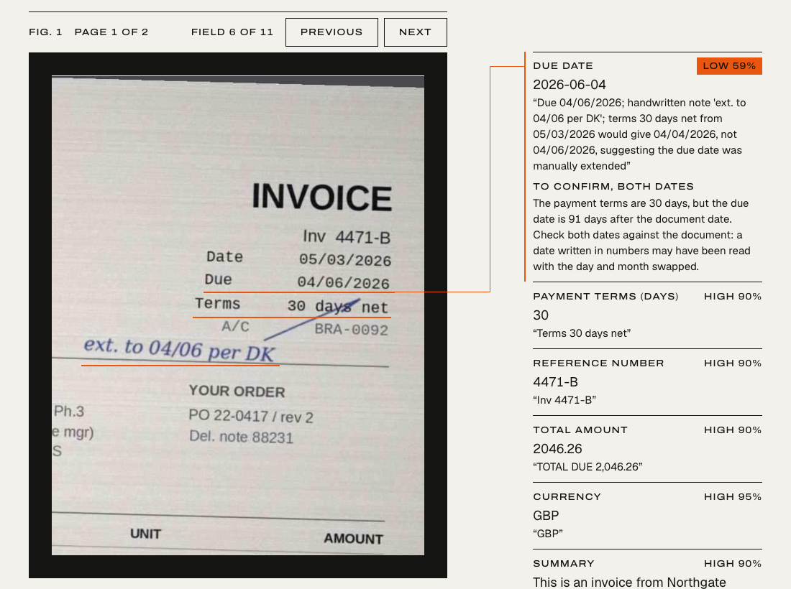
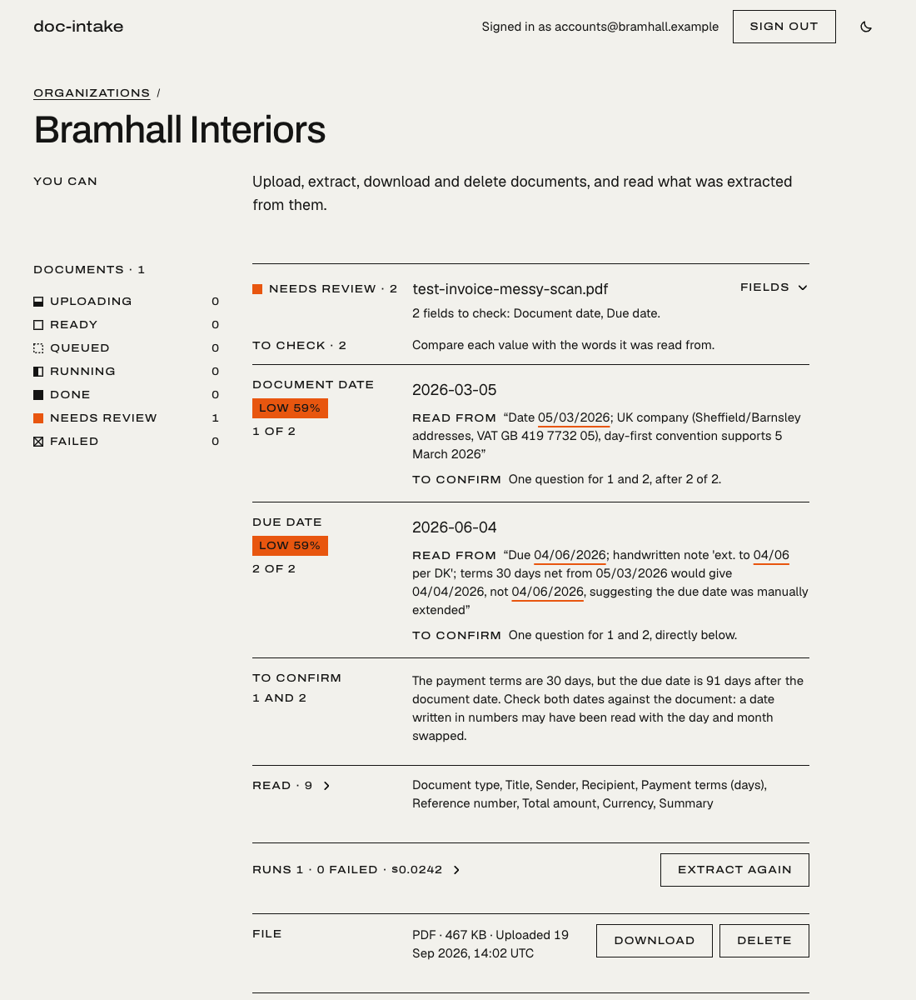
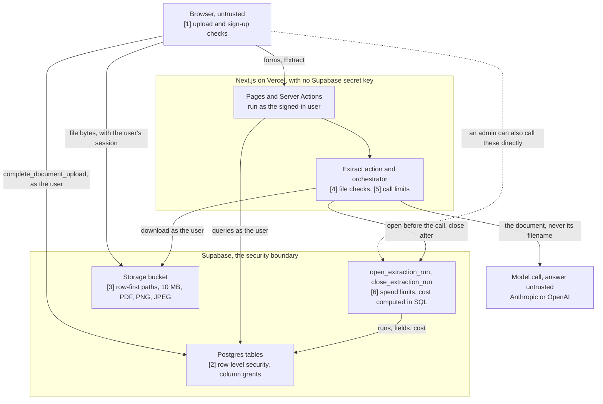

# doc-intake

doc-intake is a web app where a team uploads invoices, receipts, contracts and letters, and a language model reads each one into eleven fields, such as sender, due date and total. Values come back with the words they were read from, and any field the model is unsure of, or that fails the app's own checks, is marked for a person to check against those words.

**Live:** [doc-intake-ten.vercel.app](https://doc-intake-ten.vercel.app). The landing page walks through one real run, [field by field](https://doc-intake-ten.vercel.app/#fig-1), without signing in.

<picture>
  <source media="(prefers-color-scheme: dark)" srcset="docs/images/fig-1-dark.png">
  
</picture>

Fig. 1 on the live landing page: a real run on the deployed app on 19 Sep 2026, of a fictional two-page invoice scan, in one call to claude-sonnet-5 (8.9 s, 0.0242 USD). Nine fields came back High. The due date is 91 days after the document date although the terms say 30 days net (the scan has a handwritten extension), so the app itself put both dates at Low and wrote the question under them. The run's data is in [`fig-1.ts`](src/app/_landing/fig-1.ts), and [`landing-fig-1.test.ts`](tests/unit/landing-fig-1.test.ts) puts its values through the app's real validation and gating.

<picture>
  <source media="(prefers-color-scheme: dark)" srcset="docs/images/review-dark.png">
  
</picture>

The same invoice on its organization's page. The reviewer is shown the two fields to check, each beside the words it was read from, and one question for both; the nine other fields are folded under "Read · 9". This screen was rendered on a local dev server from static rows (`/dev/states?screen=org-doc-needs-review`, [`fixtures.ts`](src/app/dev/states/fixtures.ts)), not from a signed-in session: the document, its fields and its run are Fig. 1's, the organization and account are invented, and the route answers 404 in production.

## How it's built

Next.js 16 (App Router, Server Actions) and React 19 on Vercel, Supabase for Postgres, Auth and Storage, and the Anthropic and OpenAI SDKs ([`package.json`](package.json)). The app reaches Supabase with the publishable key and, once signed in, the user's session, never a secret key, so row-level security decides what each query can see or change. [`src/proxy.ts`](src/proxy.ts) only refreshes the session cookie; every protected page and Server Action checks the user with `requireUser()` ([`src/lib/auth.ts`](src/lib/auth.ts)). Extraction runs inside the Extract request.



Where each limit is enforced:

1. **Browser.** The [upload form](src/app/app/%5Bslug%5D/upload-form.tsx) takes PDF, PNG or JPEG up to 10 MB, and PDFs of at most 100 pages whose pages can be counted ([`page-count-browser.ts`](src/lib/page-count-browser.ts)). Sign-up takes passwords of at least 15 characters and at most 72 bytes, checked in the form and again in the sign-up Server Action ([`password-length.ts`](src/app/auth/password-length.ts), [`errors.ts`](src/lib/errors.ts)); Supabase Auth enforces the 15 too, as a dashboard setting per project, which the suite checks on its test project ("Supabase itself rejects a password shorter than 15 characters", [`tenant-isolation.test.ts`](tests/tenant-isolation.test.ts)).
2. **Postgres, row-level security.** Each organization's memberships, documents, runs and fields carry its `tenant_id`, and their policies, like those on `tenants` itself, admit only its members ([`20260917000001`](supabase/migrations/20260917000001_tenants_and_memberships.sql)). Where it matters, grants are per column: a user can insert only `tenant_id` and `filename` into `documents`, update only its `filename`, and update only `role` on `memberships`. Nobody changes their own role ([`000004`](supabase/migrations/20260917000004_restrict_membership_role_changes.sql)), a trigger keeps at least one owner ([`000007`](supabase/migrations/20260917000007_last_owner_guard.sql)), and users have no write grant on runs or fields.
3. **Storage** ([`20260917000009`](supabase/migrations/20260917000009_row_first_uploads.sql)). The bucket takes files of up to 10 MB declared as PDF, PNG or JPEG. A file is accepted only at the path its row generated, `<tenant_id>/<id>`, from the member who created the row, while the row is still uploading. There is no update policy, so nothing is overwritten or moved. The row's size and type are copied from what Storage recorded, never written by the client, and the bytes themselves are checked at Extract (item 4). The app's download links are signed URLs valid for 60 seconds, made in the browser on click ([`live-operations.tsx`](src/app/app/%5Bslug%5D/live-operations.tsx)); the 60 seconds is the app's choice, not a Storage rule.
4. **Extract action** ([`extract-action.ts`](src/app/app/extract-action.ts)). It downloads the file as the user. A file whose first bytes don't match its declared type never reaches a model ([`sniff.ts`](src/lib/extraction/sniff.ts)), and a PDF over 100 pages, or one whose pages can't be counted, is refused before a run opens ([`pages.ts`](src/lib/extraction/pages.ts)). Tests: [`sniff.test.ts`](tests/unit/sniff.test.ts), [`pages.test.ts`](tests/unit/pages.test.ts).
5. **Orchestrator** ([`run.ts`](src/lib/extraction/run.ts), [`config.ts`](src/lib/extraction/config.ts)). Each call gets 60 seconds and 2,048 output tokens. A run makes at most three calls: one switch to the other provider on a timeout, failed connection or 5xx before any answer, and one retry after an answer that fails the schema; the SDKs' own retries are off. Every answer is validated, passed through the output guard ([`guard.ts`](src/lib/extraction/guard.ts)) and banded: High from 0.85, Medium from 0.6 with one question, Low below that, and any Low field sends the document to review. The request itself ends at 240 seconds (`maxDuration` in [`page.tsx`](src/app/app/%5Bslug%5D/page.tsx)), after a whole run and before a stale run can be reaped. Tests: [`orchestrator.test.ts`](tests/unit/orchestrator.test.ts), [`max-duration.test.ts`](tests/unit/max-duration.test.ts).
6. **`open_extraction_run` and `close_extraction_run`** ([open](supabase/migrations/20260918000003_abandoned_run_estimate.sql), [close](supabase/migrations/20260918000002_close_requires_starter.sql)). Only an admin can open a run, and only the user who opened it, holding its close token, can close it. Before any model call, under one advisory lock: 1 USD per organization and 3 USD across all organizations per calendar month, and 5 runs per organization per hour. A run still open after 10 minutes is failed by the next open of that document and charged an estimate from its page count. The close has no cost parameter: it prices the token counts itself, clamped to 800,000 in and 8,192 out, from a price table users can read but not write. The limits live in `public.extraction_limits`, and a test fails if the copy in `config.ts` drifts from them. Tests: [`extraction.test.ts`](tests/extraction.test.ts) (each limit blocks a call), [`extraction_stale_runs.sql`](supabase/tests/extraction_stale_runs.sql) (the stale run).

Items 1, 4 and 5, and the download link's 60 seconds, run in code a user can go around: the browser is theirs, and an admin can call `open_extraction_run` and `close_extraction_run` directly over the API. That calls no model, but it can record a run the app never made: its token counts are bounded by the clamp and the limits, which is why item 6 takes no cost from the app, and its fields and bands are whatever the admin sends, never seen by the output guard. It is listed with the other open gaps in [SECURITY.md, "What remains"](SECURITY.md#what-remains).

## Engineering decisions

- **Postgres, not the app, is the security boundary.** The app holds no Supabase secret key, so every query runs as the signed-in user under row-level security, and [`tenant-isolation.test.ts`](tests/tenant-isolation.test.ts) signs up real users with only the publishable key to show that none can read or change another organization's rows, files or memberships ("B cannot read tenant A, its memberships or its documents", "B cannot overwrite, move or delete tenant A's file").
- **The database decides where each file goes.** The `documents` row is written first with a generated `storage_path`, and the storage policy accepts a file only at that path from that row's uploader, with no update policy, as [`tenant-isolation.test.ts`](tests/tenant-isolation.test.ts) checks ("a member can insert only tenant_id and filename", "upload is refused when no matching row exists", "re-upload and upsert to an existing path are refused").
- **Spend is checked before the call and priced after it, in SQL.** The limits are checked before any model call and the close computes the cost itself from clamped token counts, because any admin can call it directly; [`extraction.test.ts`](tests/extraction.test.ts) shows a close that passes a cost is refused ("a close cannot carry fields on failure, a cost, an unknown model, or a mismatched provider") and that each limit blocks a call ("the tenant monthly spend ceiling blocks a call").
- **The app checks the model's answer, not only its confidence.** Dates that disagree with the stated payment terms go to review whatever the model's confidence ([`dates.test.ts`](tests/unit/dates.test.ts): "sends the reported misreading to review: both dates low, whatever the model's confidence", a day and month swapped at 0.99), and an output guard, a heuristic, sends fields that look like they followed an instruction written in the document to review, with its two known misses kept as tests ([`injection.test.ts`](tests/unit/injection.test.ts)).

More detail: [SECURITY.md](SECURITY.md) (the security model, how each rule was tested, and what remains open), [EVALS.md](EVALS.md) (the eval's fixtures, scoring and limits), [ERRORS.md](ERRORS.md) (every error a user can hit and the message shown for it; no database, provider or document text reaches the page), [DESIGN.md](DESIGN.md) and [DESIGN-NOTES.md](DESIGN-NOTES.md) (the interface), [CLAUDE.md](CLAUDE.md) (working notes on the codebase's conventions).

## Running it locally

You need Node.js 22.12 or later (CI uses 24), a Supabase project, and an Anthropic or OpenAI API key. The app was built against hosted Supabase projects; the local stack in `supabase/config.toml` hasn't been used.

```bash
npm ci
cp .env.example .env.local
```

In `.env.local`, fill in `NEXT_PUBLIC_SUPABASE_URL` and `NEXT_PUBLIC_SUPABASE_PUBLISHABLE_KEY` from the project's API settings, and at least the primary provider's key: `ANTHROPIC_API_KEY`, or `OPENAI_API_KEY` with `EXTRACTION_PROVIDER=openai`. The other provider's key, if set, is the fallback. Provider keys are server-only and must never get a `NEXT_PUBLIC_` prefix. `NEXT_PUBLIC_REPO_URL` is optional; when it is set, the landing page links to the source.

Before applying the migrations, stop the project from granting new tables and functions to the API roles automatically ("Revoke default privileges" in Supabase's [Securing your API](https://supabase.com/docs/guides/api/securing-your-api#revoke-default-privileges)). The migrations grant every privilege explicitly, some of them column by column, and the rules above hold only if nothing else is granted ([SECURITY.md, "Grants"](SECURITY.md#grants)). Then apply them, reading the dry run first:

```bash
npx supabase login
npx supabase link --project-ref <your-project-ref>
npx supabase db push --dry-run
```

```bash
npx supabase db push
```

In the Supabase dashboard, set the minimum password length to 15, and turn email confirmation off for a development project. It was off on both projects this was built against when last checked ([SECURITY.md, "Auth configuration"](SECURITY.md#auth-configuration)), so the confirmation link sign-up sends to `/auth/confirm` has never run successfully ([SECURITY.md, "What the test does not prove"](SECURITY.md#what-the-test-does-not-prove)). Then run `npm run dev` and open http://localhost:3000. With the dev server running, http://localhost:3000/dev/states renders every screen of the app from static rows, without an account.

## Tests

| Command | What it runs | Needs |
|---|---|---|
| `npm run test:unit` | `tests/unit/`: validation, gating, the orchestrator with fake providers, the SDKs' error handling over a fake `fetch`, the output guard and injection fixtures, log redaction, the error catalog | nothing: no database, no network, no secrets |
| `npm test` | the unit tests plus [`tenant-isolation.test.ts`](tests/tenant-isolation.test.ts) and [`extraction.test.ts`](tests/extraction.test.ts) against a Supabase test project | `.env.test`, and the app's URL in `.env.local` or `SUPABASE_APP_URL` for the guard below |
| `npm run test:db` | [`extraction_stale_runs.sql`](supabase/tests/extraction_stale_runs.sql), the stale-run reaper, in a rolled-back transaction on the test project | `.env.test`, the app's URL as for `npm test`, and a logged-in Supabase CLI |
| `npm run eval` | the offline eval, below | nothing |
| `npm run eval -- --live` | records the answers that are missing or stale with real calls (`--force` re-records all), which cost money: at most 60 calls and 0.50 USD | both provider keys in `.env.local` |
| `npm run typecheck`, `npm run lint` | `next typegen` then `tsc --noEmit`; ESLint | nothing |
| `npm run build` | the production build | the two `NEXT_PUBLIC_SUPABASE_*` values (CI uses placeholders) |

No test calls a model: the orchestrator runs against fake or replayed providers, and Vitest loads only `SUPABASE_TEST_*` variables and blanks both provider keys, so a key exported in the shell can't reach a test ([`vitest.config.mts`](vitest.config.mts)).

**The eval.** `npm run eval` takes twelve generated PDFs ([`evals/documents/`](evals/documents), defined in [`evals/fixtures/`](evals/fixtures)), nine ordinary documents and three that carry prompt-injection attacks, and replays each provider's recorded answer to each ([`evals/recordings/`](evals/recordings)) through the real orchestrator, output guard and gating. It is free, needs no key and runs in CI. It fails on a stale recording (any change to the prompt, schema, output cap or model; [`recording.test.ts`](tests/unit/recording.test.ts)), on an injection run that fails or leaves a targeted field wrong at High or Medium, and when either provider's totals on the nine ordinary documents fall below their recorded baseline: a field lost, or a flag or a review gained. Method and limitations: [EVALS.md](EVALS.md).

**The Supabase suites** sign up five throwaway users per run with only the publishable key and check, as those signed-in users, what each can and can't do: isolation of rows, files and memberships, the upload rules, role changes, the spend ceilings and rate limit, the cost computed in the database, and that runs and fields can't be read across organizations or written directly by any user. They delete everything they create and fail if cleanup doesn't finish.

**Two projects.** The suites run against a Supabase project of their own, never the app's. The extraction suite forges spend up to the monthly ceilings, and the 3 USD ceiling counts every organization in a project, so against the app's project a test run would use up the app's monthly budget and pause extraction for every user while it runs, and until the month ends if its cleanup failed.

| | App project | Test project |
|---|---|---|
| Used by | `npm run dev`, the deployed app | `npm test`, `npm run test:db` |
| Configured in | `.env.local` (`NEXT_PUBLIC_SUPABASE_URL`, publishable key, provider keys) | `.env.test` (`SUPABASE_TEST_URL`, `SUPABASE_TEST_PUBLISHABLE_KEY`, `SUPABASE_TEST_EMAIL`) |
| Migrations | `npx supabase db push` (the CLI is linked to it) | `npx supabase db push --project-ref <test ref>` |
| Email confirmation | as the app needs it | off |

Every migration goes to both projects, the test project first. [`scripts/supabase-test-target.mjs`](scripts/supabase-test-target.mjs) makes both Vitest suites and `test:db` refuse to run when the test URL has the same project ref as the app's, or the test key is the app's (read from any `.env*` file Next.js reads, or `SUPABASE_APP_URL` in the environment), and when no app project is known at all, so a missing `.env.local` can't skip the check ([`supabase-target.test.ts`](tests/unit/supabase-target.test.ts)). `test:db` passes the test project's ref to the CLI, so the CLI stays linked to the app's project.

To run them:

1. Create a second Supabase project for tests, with the same default-privileges setting, and apply every migration to it: `npx supabase db push --project-ref <test ref>` (show `--dry-run` first).
2. Turn email confirmation off on it (Authentication → Sign In / Providers → Email), since the tests need a session straight from sign-up.
3. Copy `.env.test.example` to `.env.test` and fill in the **test** project's URL and publishable key, and `SUPABASE_TEST_EMAIL`: a real mailbox the test users sign up on as plus-addresses, since hosted Supabase refuses `example.com`. Never a secret or service role key.
4. Run `npm test`. Sign-ups count toward the test project's auth rate limit, so many runs in a row may be throttled.

**CI** ([`ci.yml`](.github/workflows/ci.yml), actions pinned to commit SHAs) runs the type check, lint, build, unit tests and offline eval on every push and pull request, with no secrets. The Supabase suites run only when started by hand (Actions → CI → Run workflow → "Also run the Supabase suites"), one at a time, never cancelled mid-run. They need these repository settings, none of which are set yet, so the suites have so far run only locally:

| Name | Kind | Value |
|---|---|---|
| `SUPABASE_TEST_URL` | secret | the test project's URL |
| `SUPABASE_TEST_PUBLISHABLE_KEY` | secret | the test project's publishable key |
| `SUPABASE_TEST_EMAIL` | secret | a real mailbox; each test user signs up as a plus-address on it, because hosted Supabase refuses example and test domains. With email confirmation off, nothing is sent |
| `SUPABASE_TEST_EMAIL_DOMAIN` | secret, optional | instead of `SUPABASE_TEST_EMAIL`, a domain for generated addresses, for a project that accepts it |
| `SUPABASE_APP_URL` | variable | the app project's URL, which the guard compares against. It isn't secret; the browser sees it |

CI doesn't run `test:db`. The Supabase CLI reaches a project through a personal access token, which is scoped to the whole account, the app project included, so putting one in CI would give the workflow write access to production. Run it locally.

A second workflow, [`keep-alive.yml`](.github/workflows/keep-alive.yml), is set to read the app project once a day with its publishable key, so the free plan doesn't pause it; it fails until the repository secrets `SUPABASE_URL` and `SUPABASE_PUBLISHABLE_KEY` are set.

## Status

The queue worker on the [`worker`](https://github.com/bernardalmassi/doc-intake/tree/worker) branch (pgmq, a worker route and a spend ledger) is built and in review, not live; production runs extraction inside the request, as described above.
